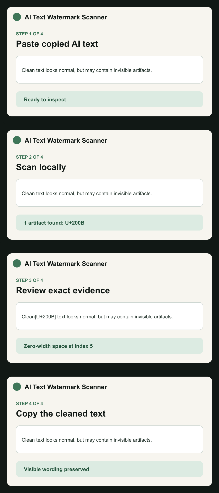

# AI Text Watermark Scanner

[](https://www.npmjs.com/package/ai-text-watermark-scanner)
[](https://github.com/GeeDotDee/ai-text-watermark-scanner)
[](LICENSE)

Inspect and clean literal hidden text artifacts without rewriting the visible words.



A dependency-free, local-first JavaScript scanner for literal hidden Unicode and removable formatting artifacts. It reports exact code points and locations, creates a conservative cleaned copy, and makes no authorship claim.

## Why this exists

Copied AI text can contain zero-width characters, directional controls, unusual spaces, or formatting artifacts. A generative rewrite can change meaning. This package takes the deterministic route: identify the exact character, show its location, and remove only supported literal artifacts.

It is intentionally separate from statistical model watermark detection. Provider-level signals require an official supported verifier.

## What you get

- Exact Unicode code points and source locations
- Conservative cleaning with readable wording preserved
- Dependency-free JavaScript and TypeScript types
- CLI output for local files
- SARIF 2.1.0 export for CI and GitHub Code Scanning
- Public fixtures shared with the hosted scanner and browser tools
- No text upload, telemetry, or authorship accusation

## Install

```bash
npm install ai-text-watermark-scanner
```

## JavaScript

```js
import { scanText } from "ai-text-watermark-scanner";

const result = scanText("copied text");
console.log(result.findings);
console.log(result.cleanedText);
```

## CLI

```bash
ai-watermark-scan draft.txt
```

Export SARIF 2.1.0 for GitHub Code Scanning or another CI system:

```bash
ai-watermark-scan draft.txt --sarif > ai-text-watermark-results.sarif
```

SARIF output includes deterministic artifact findings, exact code points, severity, and source locations. It does not claim AI authorship or official model-level watermark detection.

## Example result

```json
{
  "findings": [
    {
      "codePoint": "U+200B",
      "name": "ZERO WIDTH SPACE",
      "index": 6,
      "removable": true
    }
  ],
  "cleanedText": "Clean text"
}
```

## Use it in CI

```bash
ai-watermark-scan content.txt --sarif > results.sarif
```

Upload `results.sarif` to GitHub Code Scanning or another SARIF-compatible system. Findings remain deterministic and reviewable.

## Integration examples

- [Node.js](examples/node.mjs)
- [Hosted scan API](examples/api.mjs)
- [GitHub Actions and SARIF](examples/github-actions.yml)

## Choosing the right tool

| Need | Use |
| --- | --- |
| Exact hidden-character evidence | This package |
| Lossless literal artifact cleaning | This package |
| Browser copy workflow | [Browser extension](https://aitextwatermark.com/extension) |
| File and batch reports | [Hosted product](https://aitextwatermark.com) |
| Official provider watermark conclusion | A connected provider verifier |
| Stylistic rewriting or humanization | A rewriting tool, with semantic review |

The package does not detect or claim to remove statistical model-level watermarks such as deployed provider token-sampling signals. Use [AI Text Watermark Remover](https://aitextwatermark.com) for the hosted scanner, reports, batch workflows, browser tools, and current provider guidance.

## Public verification

- [Literal artifact coverage benchmark](https://aitextwatermark.com/benchmarks/artifact-coverage)
- [Downloadable Unicode fixtures](https://aitextwatermark.com/fixtures/artifact-coverage-v1.json)
- [Browser answer-selection compatibility](https://aitextwatermark.com/extension/compatibility)
- [Downloadable provider fixtures](https://aitextwatermark.com/fixtures/provider-answer-detection-v1.json)
- [Hosted and self-hosted API documentation](https://aitextwatermark.com/developers)
- [Provider capability API](https://aitextwatermark.com/api/v1/providers)
- [Provider adapter conformance contract](https://aitextwatermark.com/fixtures/provider-adapter-contract-v1.json)

The hosted product and self-hosted API use the same deterministic literal-artifact rules as this package. Provider-specific model-watermark verification remains separate and is reported only when an official supported verifier is available.
